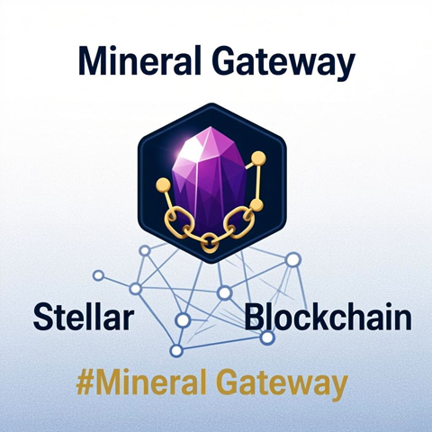
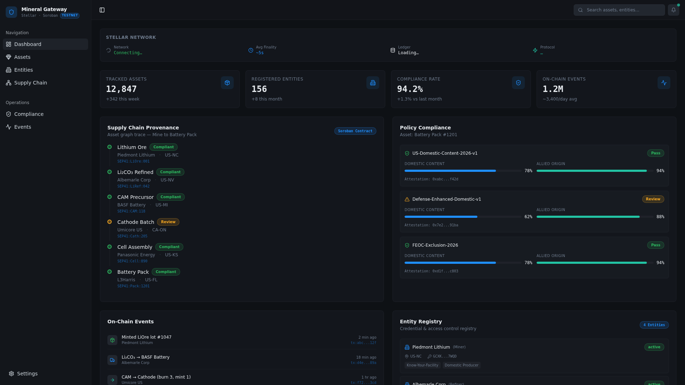
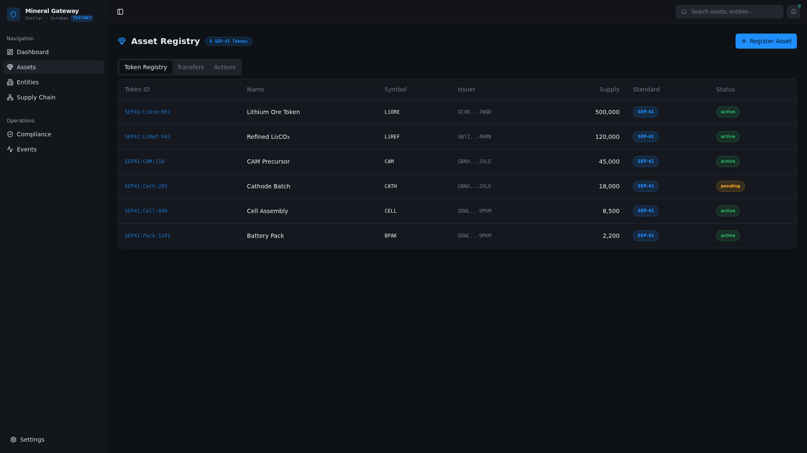
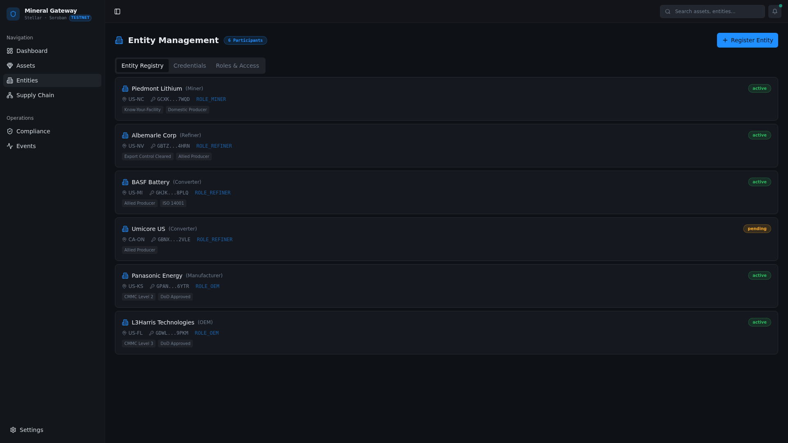
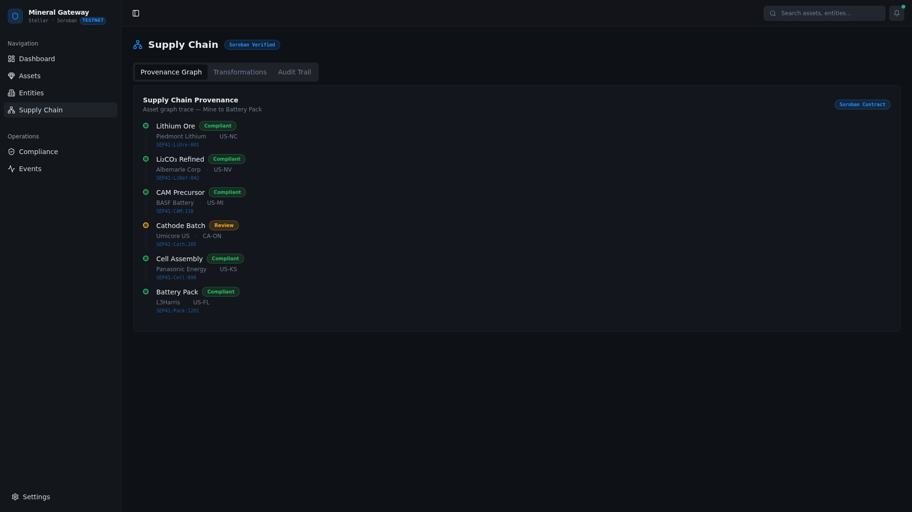
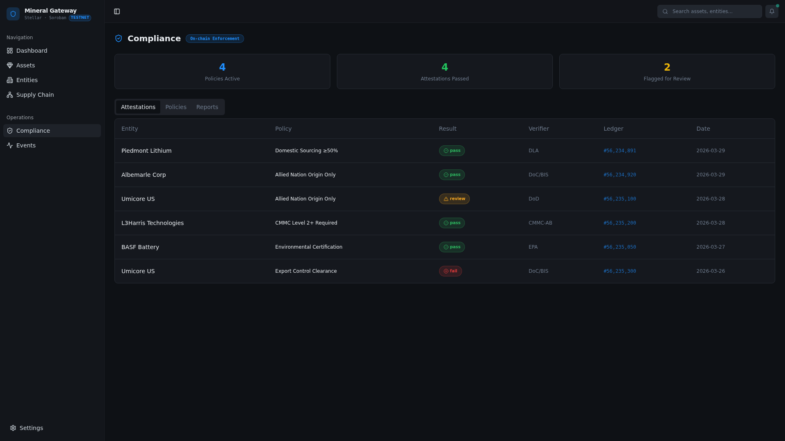
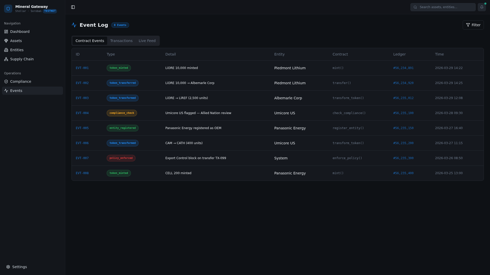
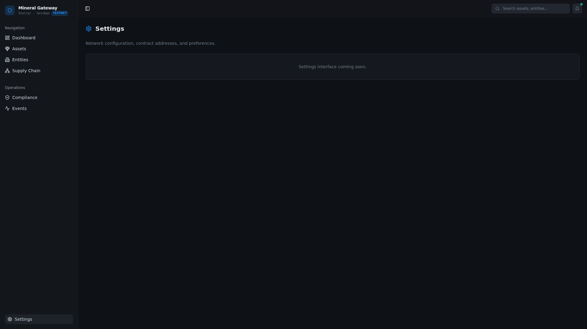

  

<h1 align="center">Mineral Gateway</h1>

  <strong>Agent-Powered Critical Minerals Traceability on Stellar</strong>

  
  
  
  
  

---

## Overview

Mineral Gateway is a Stellar/Soroban-based platform that combines on-chain critical minerals traceability with autonomous AI agent capabilities and machine-to-machine (M2M) payments. Built for US defense and industrial policy compliance, the platform tracks mineral provenance from mine to battery pack using SEP-41 tokenized asset lots — and exposes every operation as a payable, agent-accessible service via the x402 protocol and Machine Payments Protocol (MPP).

## Problem

The global critical minerals supply chain — lithium, cobalt, nickel, rare earths — is opaque, fragmented, and vulnerable to fraud. US defense and industrial policy (including FEOC — Foreign Entity of Concern — restrictions) requires verifiable provenance from mine to end product. Today, this verification is manual, slow, paper-based, and easily spoofed.

## Solution

Mineral Gateway builds a vertically integrated traceability stack on Stellar:

1. **Tokenizes mineral asset lots** as SEP-41 tokens, creating an immutable, auditable record of every lot from extraction through processing, shipping, and assembly.

2. **Maps the full supply chain** as a directed provenance graph stored on-chain via Soroban smart contracts, where each node represents a transformation step and each edge is cryptographically signed.

3. **Computes compliance metrics** in real time — domestic content percentage, allied-origin percentage, FEOC contamination flags — derived directly from on-chain provenance data.

4. **Exposes every operation as an x402-paid endpoint**: any agent with a Stellar wallet can invoke compliance checks, request provenance reports, or subscribe to monitoring feeds by attaching a micro-payment to a standard HTTP request.

5. **Supports MPP machine-to-machine flows** for recurring supply chain payments: raw material purchases, assay fees, shipping payments, and compliance audit fees can all be automated between agents.

## Dashboard

| View | Description |
|------|-------------|
|  | Main dashboard with supply chain overview |
|  | Tokenized mineral asset lots |
|  | Supply chain participants |
|  | End-to-end provenance graph |
|  | Real-time compliance metrics |
|  | On-chain event log |
|  | Configuration panel |

## Tech Stack

- **Blockchain**: Stellar / Soroban smart contracts
- **Token Standard**: SEP-41 (tokenized assets)
- **Payment Protocols**: x402 (HTTP micropayments), MPP (machine-to-machine)
- **Frontend**: React + TypeScript + Vite + Tailwind CSS
- **Compliance**: FEOC screening, domestic content calculation, allied-origin tracking

## Getting Started

See [BUIDL.md](BUIDL.md) for detailed build instructions and architecture documentation.

## License

MIT
